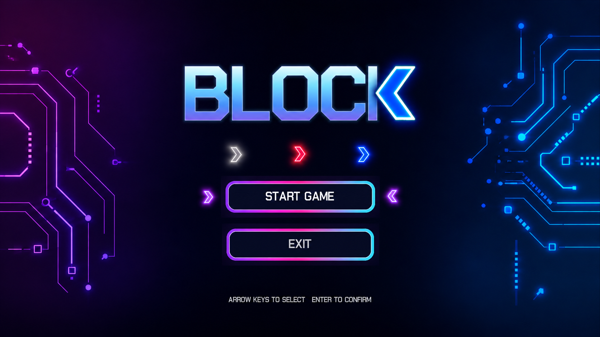
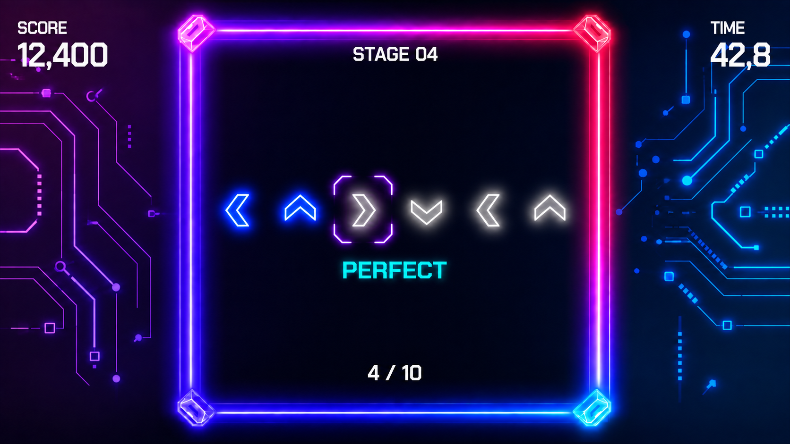
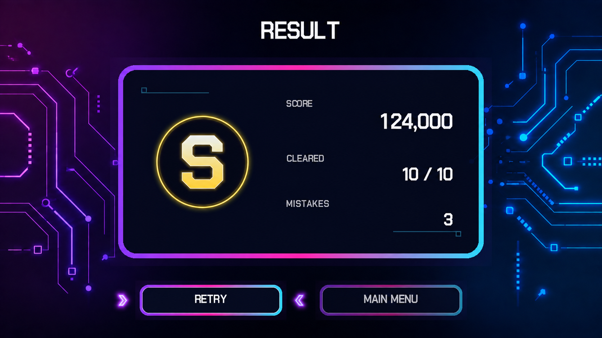

# 블락(Block) 게임 기획서

## 1. 게임 개요

| 항목 | 내용 |
| --- | --- |
| 제목 | 블락(Block) |
| 장르 | 2D 방향키 커맨드 게임 |
| 플랫폼 | Windows PC |
| 플레이 인원 | 1인 |
| 플레이 시간 | 60초 |
| 조작 | 키보드 방향키, Enter |

`블락`은 화면에 표시된 화살표 순서를 보고 같은 방향키를 차례대로 입력하는 게임이다. 제한 시간 동안 10개의 스테이지를 진행하며, 뒤로 갈수록 입력해야 할 화살표가 많아진다.

게임의 핵심은 복잡한 조작 없이 커맨드를 빠르고 정확하게 입력하는 것이다. 화살표는 이동하지 않으며 음악과 입력 시점을 맞출 필요도 없다.

---

## 2. 기본 진행

1. 스테이지가 시작되면 무작위 방향의 화살표가 한 줄로 표시된다.
2. 보라색 테두리가 현재 입력할 화살표를 표시한다.
3. 플레이어가 방향키를 한 번 누르면 현재 화살표의 결과가 결정된다.
4. 정답이면 파란색, 오답이면 빨간색으로 변경된다.
5. 보라색 테두리가 다음 화살표로 이동한다.
6. 모든 화살표를 입력하면 다음 스테이지로 넘어간다.
7. 10개 스테이지를 모두 완료하거나 제한 시간 60초가 끝나면 결과 화면으로 이동한다.

화살표 순서는 상·하·좌·우 중 무작위로 생성하며 같은 방향이 연속해서 나올 수 있다.

---

## 3. 입력 상태

| 표시 | 의미 |
| --- | --- |
| 회색 화살표 | 아직 입력하지 않은 커맨드 |
| 파란색 화살표 | 올바르게 입력한 커맨드 |
| 빨간색 화살표 | 잘못 입력한 커맨드 |
| 보라색 테두리 | 현재 입력할 위치 |

오답이 발생해도 화살표의 방향은 원래 제시된 방향을 유지한다. 플레이어가 누른 잘못된 방향으로 이미지를 바꾸지 않는다.

예를 들어 제시된 커맨드가 `← ↑ →`이고 두 번째 입력에서 `↓`를 눌렀다면 다음과 같이 표시한다.

```text
파란색 ←    빨간색 ↑    회색 →
                         ↑ 현재 입력 위치
```

정답과 오답 모두 입력 한 번으로 처리되며, 판정 후에는 다음 화살표로 진행한다.

---

## 4. 스테이지 구성

| 스테이지 | 화살표 수 |
| --- | ---: |
| 1~2 | 3개 |
| 3~4 | 4개 |
| 5~6 | 5개 |
| 7~8 | 6개 |
| 9~10 | 7개 |

총 커맨드 수는 50개다. 한 스테이지의 모든 입력이 정답이면 `PERFECT`를 표시한다. 오답 입력 시 해당 화살표를 빨간색으로 변경하고 `MISS`를 짧게 표시한다.

배경음악은 분위기 연출에만 사용하며 게임 규칙이나 입력 판정에는 영향을 주지 않는다.

---

## 5. 점수와 결과

### 5.1 점수

- 정답 입력: 100점
- 오답 입력: 0점
- 한 스테이지를 모두 정답으로 완료: 추가 500점
- 최대 점수: 10,000점

### 5.2 결과 등급

| 등급 | 점수 |
| --- | ---: |
| S | 9,000점 이상 |
| A | 7,500점 이상 |
| B | 6,000점 이상 |
| C | 4,000점 이상 |
| F | 4,000점 미만 |

결과 화면에는 다음 항목을 표시한다.

- 최종 등급
- 최종 점수
- 완료한 스테이지 수
- 총 오답 수

---

## 6. 화면 구성

게임은 시작, 플레이, 결과의 세 Scene으로 구성한다.

```text
시작 Scene
  ↓ START GAME
플레이 Scene
  ↓ 10개 스테이지 완료 또는 제한 시간 종료
결과 Scene
  ├─ RETRY → 플레이 Scene
  └─ MAIN MENU → 시작 Scene
```

### 6.1 시작 Scene



- 게임 로고
- `START GAME` 버튼
- `EXIT` 버튼
- 방향키로 선택하고 Enter로 결정

### 6.2 플레이 Scene



- 왼쪽 위: 현재 점수
- 가운데 위: 현재 스테이지
- 오른쪽 위: 남은 시간
- 중앙: 입력할 화살표 순서
- 보라색 테두리: 현재 입력 위치
- 아래: 진행한 스테이지 수

### 6.3 결과 Scene



- 등급, 점수, 완료 스테이지, 오답 수 표시
- `RETRY`: 게임을 처음부터 다시 시작
- `MAIN MENU`: 시작 화면으로 이동

---

## 7. 주요 객체

| 객체 | 역할 |
| --- | --- |
| `GameMain` | Scene 전환, 전체 초기화와 실행 관리 |
| `TitleScene` | 시작 메뉴 입력과 화면 출력 |
| `GameplayScene` | 제한 시간, 스테이지 진행, 방향키 입력 관리 |
| `ResultScene` | 최종 결과와 메뉴 출력 |
| `CommandStage` | 화살표 순서 생성, 현재 입력 위치와 결과 저장 |
| `ScoreManager` | 점수, 오답 수, 등급 계산 |

`CommandStage`의 각 화살표는 방향과 입력 상태를 가진다.

```text
Direction: Up / Down / Left / Right
State: Pending / Correct / Wrong
```

---

## 8. 리소스 구성

```text
resource/
├─ image/
│  ├─ frame/               # 플레이 영역 테두리
│  ├─ note/
│  │  ├─ gray/             # 입력 대기
│  │  ├─ blue/             # 정답
│  │  └─ red/              # 오답
│  └─ ui/
│     ├─ background.png
│     ├─ command/current.png
│     ├─ judgment/         # PERFECT, MISS
│     ├─ grade/            # S, A, B, C, F
│     └─ menu/             # 로고, 버튼, 결과 패널
└─ audio/
   ├─ bgm/                 # 플레이 배경음악
   └─ effect/              # 입력 및 메뉴 효과음
```
